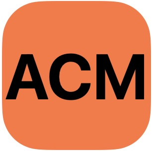

# Past Meetings

Blabla about past meetings.

## Slides

https://openreview.net/group?id=NeurIPS.cc/2023/Workshop/CRL

<!-- ## Camera-Ready Revisions 

Camera-Ready revisions are now enabled in OpenReview. While the workshop has no official proceedings, we strongly encourage you to submit a revised "camera-ready" version taking reviewers' comments and suggestions into account. We suggest uploading a revised version prior to the workshop, and possibly another final version (incorporating additional feedback from the poster session and workshop) by the revision deadline of 12 August, one week after the workshop. 

## Updated Style-File 

To prepare your revision/camera-ready version, please use the following template: https://www.overleaf.com/read/jcgtpdmnkfhy [Menu -> Download Source -> unzip -> replace previous style file with the new uaicrl2022.cls -> add \documentclass[accepted]{uaicrl2022} to your tex file] -->

